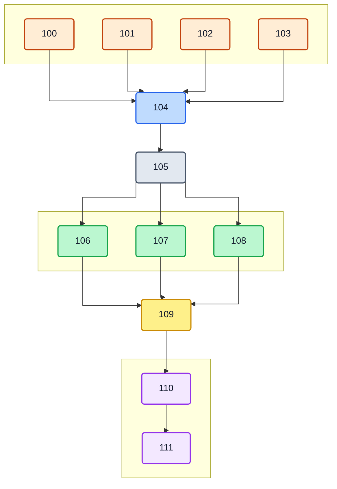
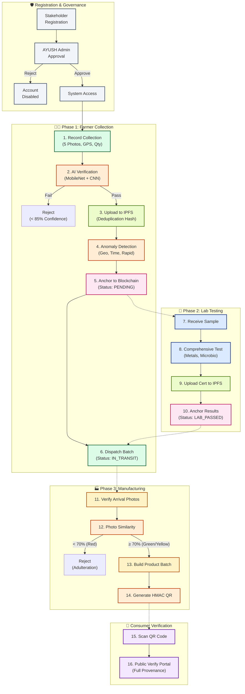
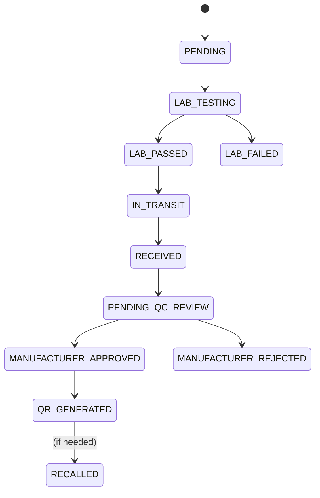

<p align="center">
  
</p>

<h1 align="center">🌿 BotaniLedger</h1>

<p align="center">
  <strong>Blockchain-Powered Traceability for the Botanical & AYUSH Supply Chain</strong>
</p>

<p align="center">
  <a href="#"></a>
  <a href="https://opensource.org/licenses/MIT"></a>
  <a href="https://react.dev/"></a>
  <a href="https://nodejs.org/"></a>
  <a href="https://www.hyperledger.org/use/fabric"></a>
  <a href="#"></a>
  <a href="#"></a>
  <a href="#"></a>
</p>

---

## 📖 Overview

**BotaniLedger** is a production-grade, full-stack supply chain transparency platform purpose-built for India's **₹40,000 Cr+ AYUSH & botanical industry**. It guarantees ingredient authenticity from **farm to pharmacy** by combining:

- 🧠 **Custom CNN AI** — A MobileNetV2-based species classifier trained on Ashwagandha & Tulsi
- ⛓️ **Hyperledger Fabric** — Private permissioned blockchain for immutable batch lifecycle records
- 📦 **IPFS (Pinata)** — Decentralized storage for collection photos & lab certificates
- 🔍 **Anomaly Detection Engine** — Geo-inconsistency, duplicate photo, and rapid-submission fraud detection
- 📱 **Offline-First Architecture** — Zustand + localStorage sync for rural farming zones

> Unlike generic supply chain trackers, BotaniLedger is **domain-specific** to botanical herbs, integrating AI species verification directly into the collection workflow and enforcing AYUSH Ministry governance through a multi-role approval system.

---

## 🏗️ System Architecture (High-Level)



---

## 🔄 Complete Workflow Block Diagram



### 📝 Workflow Description (Step-by-Step)

**Step 1 — Stakeholder Registration & Approval:**
Every participant (Farmer, Lab, Manufacturer, Regulator) registers on the platform with their organization details and license number. Accounts enter a `pending` state and remain inactive until the **AYUSH Ministry Admin** manually reviews and approves them. This ensures only verified, real-world entities participate in the supply chain — preventing ghost accounts and unauthorized access.

**Step 2 — Farmer Records a Herb Collection:**
Farmers in the field capture **5 standardized photos** (macro, texture, bulk, packaging, context) of their botanical harvest along with GPS coordinates, species name, quantity, and collection date. If the farmer is in a low-connectivity rural area, the data is stored locally using the **offline-first Zustand store** and synced automatically when internet is available.

**Step 3 — AI Species Verification (Two-Stage):**
The uploaded photo passes through a **two-stage AI pipeline**. First, a pre-trained **MobileNetV2 (ImageNet)** model checks whether the image is actually a plant (filtering out non-botanical uploads). If it passes, the image is sent to a **custom-trained CNN** (Ashwagandha vs Tulsi classifier) running on a FastAPI microservice. The system returns a confidence score, purity rating, quality grade (A/B/Reject), and moisture estimate. Only batches with **≥85% confidence** proceed.

**Step 4 — IPFS Upload & Image Deduplication:**
All 5 photos are uploaded as a folder to **IPFS via Pinata**, generating a unique Content Identifier (CID). Before upload, each image is hashed with **SHA-256** and checked against the database to prevent reuse of previously submitted photos across different batches — a key anti-fraud measure.

**Step 5 — Anomaly Detection:**
The system automatically scans for suspicious patterns: (a) **Duplicate IPFS CIDs** — same photos reused by different farmers, (b) **Geo-inconsistency** — two batches from the same farmer registered 100km+ apart within 4 hours, (c) **Rapid submission** — more than 10 batches/hour from one farmer. Flagged anomalies are surfaced to the Admin dashboard with severity levels (MEDIUM / HIGH / CRITICAL).

**Step 6 — Blockchain Anchoring:**
The batch record (hash, timestamp, farmer ID, AI results, IPFS CID) is committed to the **Hyperledger Fabric** ledger via chaincode. The batch enters `PENDING` status. The blockchain ensures this record is **immutable** — no single party can alter it retroactively.

**Step 7 — Lab Testing & Certification:**
A certified lab receives the physical sample linked to the Batch ID. They perform comprehensive testing: **heavy metals** (lead, mercury, arsenic, cadmium), **pesticide residues**, **microbiology** (E. coli, Salmonella), **physicochemical properties** (ash content, extractive values, moisture), and **active ingredient** concentration. Results are uploaded as an encrypted PDF to **IPFS**, and the CID is anchored to the blockchain. The batch moves to `LAB_PASSED` or `LAB_FAILED`.

**Step 8 — Farmer Dispatches to Manufacturer:**
Once lab-certified, the farmer dispatches the batch. The chaincode records transport mode, estimated arrival, and a digital farmer signature. The batch status changes to `IN_TRANSIT`.

**Step 9 — Manufacturer Verifies Arrivals:**
When the batch arrives, the manufacturer takes new photos and the system runs a **photo similarity check** comparing arrival photos against the original collection photos. Scores are categorized: **≥90% = GREEN** (auto-approved), **70–89% = YELLOW** (pending QC review), **<70% = RED** (rejected — potential adulteration, triggers `AdulterationDetected` blockchain event).

**Step 10 — Product Building & QR Generation:**
The manufacturer links one or more approved herb batches into a final **Product Batch** (tablet, capsule, oil, powder, etc.). The system performs **integrity checks** — verifying all linked batches are lab-passed, similarity-approved, and custody-transferred. An **HMAC-signed QR code** is generated containing a cryptographic signature that prevents URL tampering.

**Step 11 — Consumer Verification:**
End consumers scan the QR code on the product, which opens a **public verification portal**. The portal displays the complete provenance chain: farmer details, collection location, AI verification results, lab test reports, manufacturer info, and blockchain transaction IDs — providing full **farm-to-pharmacy transparency** without requiring login.

---

## ⭐ Features

### 🧠 AI-Powered Species Verification (Unique)
- **Two-stage pipeline**: ImageNet MobileNetV2 pre-validates if image is a plant, then custom CNN classifies Ashwagandha vs Tulsi
- Confidence threshold: **85%** with margin analysis
- Purity scoring, quality grading (A/B/Reject), moisture estimation
- FastAPI microservice with TensorFlow backend

### ⛓️ Hyperledger Fabric Blockchain
- **2 Smart Contracts**: `HerbBatchContract` (8 functions) + `ProductBatchContract` (2 functions)
- MSP-based access control (FarmerOrg, LabOrg, ManufacturerOrg)
- Chaincode events: `BatchRegistered`, `LabResultRecorded`, `CustodyTransferComplete`, `AdulterationDetected`, `BatchRecalled`
- Kaleido-hosted with gRPC + TLS + Basic Auth

### 🛡️ Multi-Layer Anomaly Detection (Unique)
| Check | Severity | Trigger |
|-------|----------|---------|
| Duplicate IPFS CID | HIGH | Same photos reused across batches |
| Geo-Inconsistency | CRITICAL | 100km+ apart within 4 hours |
| Rapid Submissions | MEDIUM | >10 batches/hour from same farmer |
| Expired Certificate | HIGH | Lab cert past validity |

### 🔐 Trust Scoring Engine (Unique)
Weighted stakeholder reputation: **Lab Pass Rate (40%) + AI Similarity (35%) + On-Time Handover (25%)**

### 📦 Decentralized Storage (IPFS)
- Multi-gateway fallback (Pinata → Cloudflare → dweb.link → ipfs.io)
- Folder-level CID for batch photo collections
- SHA-256 image deduplication before upload

### 📴 Offline-First for Rural Areas
- Zustand + localStorage persistence
- Queue-based sync with retry logic
- Auto-detect connectivity via browser events

### 👥 5-Role RBAC System
| Role | Capabilities |
|------|-------------|
| **Farmer** | Record collection, AI verify, dispatch, sync offline |
| **Lab** | Test batches, issue certificates, upload to IPFS |
| **Manufacturer** | Verify arrivals, similarity check, build products, generate QR |
| **AYUSH Admin** | Approve stakeholders, anomaly alerts, batch explorer, farmer registry |
| **Regulator** | Audit trails, trend analytics, anomaly reports |

### 🔔 Multi-Channel Notifications
- Firebase Cloud Messaging (push)
- Nodemailer SMTP (email alerts)

### 📊 QR-Based Consumer Verification
- HMAC-signed URLs prevent tampering
- Public portal shows full provenance chain

---

## 🏗️ Batch Lifecycle States



---

## 📁 Project Structure

```
BotaniLedger/
├── 📄 server.js                    # Express entry point
├── 📄 package.json                 # Dependencies & scripts
├── 📄 vite.config.mjs              # Vite bundler config
├── 📄 vercel.json                  # SPA routing for Vercel
│
├── 📂 src/
│   ├── 📄 App.jsx                  # Route definitions (30+ routes)
│   ├── 📄 main.jsx                 # React DOM entry
│   ├── 📄 app.js                   # Express app setup + middleware
│   │
│   ├── 📂 config/                  # Environment configs
│   │   ├── database.js             # MongoDB connection
│   │   ├── redis.js                # Redis client
│   │   ├── fabric.js               # Hyperledger Fabric config
│   │   ├── ipfs.js                 # Pinata/IPFS config
│   │   └── environment.js          # Env variable validation
│   │
│   ├── 📂 models/                  # Mongoose schemas (8 models)
│   │   ├── User.js                 # 5 roles, bcrypt, fabric identity
│   │   ├── HerbCollection.js       # Batch with 11 status states
│   │   ├── LabReport.js            # Full phytochemical testing
│   │   ├── ProductBatch.js         # Linked batches + QR + recall
│   │   ├── AnomalyAlert.js         # Fraud detection alerts
│   │   ├── AuditLog.js             # Admin action logging
│   │   ├── ImageAsset.js           # SHA-256 dedup tracking
│   │   └── SyncQueue.js            # Offline sync queue
│   │
│   ├── 📂 controllers/            # Route handlers (7 controllers)
│   │   ├── auth.controller.js      # Login/Register/Refresh
│   │   ├── farmer.controller.js    # Collection + dispatch
│   │   ├── lab.controller.js       # Testing + certification
│   │   ├── manufacturer.controller.js  # Verify + build + QR
│   │   ├── admin.controller.js     # Approvals + governance
│   │   ├── regulator.controller.js # Audit + analytics
│   │   └── verify.controller.js    # Public QR verification
│   │
│   ├── 📂 services/               # Business logic (10 services)
│   │   ├── fabric.service.js       # Blockchain transactions
│   │   ├── ai.service.js           # CNN species verification
│   │   ├── ipfs.service.js         # Pinata upload + retrieval
│   │   ├── anomaly.service.js      # Fraud detection engine
│   │   ├── trust.service.js        # Reputation scoring
│   │   ├── qr.service.js           # HMAC-signed QR generation
│   │   ├── image-dedup.service.js  # SHA-256 duplicate detection
│   │   ├── notification.service.js # Firebase + Email alerts
│   │   ├── sync.service.js         # Offline queue processor
│   │   └── admin.init.js           # Default admin seeding
│   │
│   ├── 📂 middleware/              # Express middleware (6)
│   │   ├── auth.middleware.js      # JWT verification
│   │   ├── rbac.middleware.js      # Role-based access control
│   │   ├── audit.middleware.js     # Action logging
│   │   ├── rateLimit.middleware.js # DDoS protection
│   │   ├── upload.middleware.js    # Multer file handling
│   │   └── validate.middleware.js  # Schema validation
│   │
│   ├── 📂 routes/                  # API routes (7 routers)
│   │   ├── auth.routes.js
│   │   ├── farmer.routes.js
│   │   ├── lab.routes.js
│   │   ├── manufacturer.routes.js
│   │   ├── admin.routes.js
│   │   ├── regulator.routes.js
│   │   └── verify.routes.js
│   │
│   ├── 📂 pages/                   # React pages (22 pages)
│   │   ├── 📂 landing/            # Public landing page
│   │   ├── 📂 auth/               # Login, Register, AwaitingApproval
│   │   ├── 📂 farmer/             # Dashboard, Record, Batches, Sync
│   │   ├── 📂 lab/                # Dashboard, Test, Certificates, Analytics
│   │   ├── 📂 manufacturer/       # Dashboard, Verify, Build, QR, Production
│   │   ├── 📂 admin/              # Dashboard, Approvals, Batches, Farmers, Alerts
│   │   ├── 📂 regulator/          # Portal, Audit, Trends, Reports
│   │   ├── 📂 verify/             # Public QR verification portal
│   │   └── 📂 shared/             # Settings page
│   │
│   ├── 📂 components/shared/      # Reusable UI components (8)
│   │   ├── Header.jsx, Sidebar.jsx, Modal.jsx, UI.jsx
│   │   └── FarmerLayout, LabLayout, AdminLayout, ManufacturerLayout
│   │
│   ├── 📂 lib/                     # Frontend utilities
│   │   ├── api.js                  # Axios client + interceptors
│   │   ├── store.js                # Zustand auth store
│   │   └── offlineStore.js         # Offline-first persistence
│   │
│   └── 📂 utils/                   # Backend utilities
│       ├── crypto.util.js          # HMAC generation
│       ├── geo.util.js             # Haversine distance
│       ├── logger.util.js          # Winston logger
│       └── response.util.js        # Standardized API responses
│
├── 📂 ai-service/                  # Python AI microservice
│   ├── main.py                     # FastAPI + MobileNetV2 + Custom CNN
│   ├── train_two_plants.py         # Model training script
│   ├── requirements.txt            # TensorFlow, FastAPI, Pillow
│   ├── Dockerfile                  # Container config
│   └── start.sh                    # Production startup
│
├── 📂 blockchain/
│   ├── 📂 chaincode/botanyledger/
│   │   ├── contracts/
│   │   │   ├── HerbBatchContract.js    # 8 functions
│   │   │   └── ProductBatchContract.js # 2 functions
│   │   ├── index.js                    # Contract entry
│   │   └── package.json
│   └── 📂 network/                     # Fabric network configs
│
├── 📂 docker/
│   ├── Dockerfile                  # Node.js container
│   ├── docker-compose.prod.yml     # Production orchestration
│   └── 📂 nginx/                   # Reverse proxy config
│
├── 📂 scripts/                     # DevOps scripts
│   ├── deploy-chaincode.sh
│   ├── network-up.sh
│   └── network-down.sh
│
└── 📂 docs/
    └── ARCHITECTURE.md             # Technical architecture guide
```

---

## 🛠️ Tech Stack

| Layer | Technology | Purpose |
|-------|-----------|---------|
| **Frontend** | React 19 + Vite 8 | SPA with HMR |
| **Styling** | TailwindCSS 3 | Utility-first responsive design |
| **Animation** | Framer Motion | Micro-interactions & transitions |
| **State** | Zustand 5 | Global auth + offline persistence |
| **Data Fetching** | TanStack Query 5 | Cache, refetch, optimistic updates |
| **Forms** | React Hook Form + Zod | Validated form handling |
| **Charts** | Recharts 3 | Analytics dashboards |
| **Icons** | Lucide React | Modern iconography |
| **Backend** | Node.js + Express 4 | REST API server |
| **Database** | MongoDB + Mongoose 8 | Document store for metadata |
| **Cache** | Redis (ioredis) | Rate limiting + token caching |
| **Auth** | JWT (Access + Refresh) | Stateless authentication |
| **Blockchain** | Hyperledger Fabric | Immutable supply chain records |
| **AI Engine** | TensorFlow + FastAPI | MobileNetV2 species classifier |
| **Storage** | IPFS via Pinata | Decentralized photo/cert storage |
| **Notifications** | Firebase Admin + Nodemailer | Push + email alerts |
| **QR Codes** | qrcode + qrcode.react | HMAC-signed verification codes |
| **Monitoring** | Winston + Prometheus | Logging + metrics |
| **Security** | Helmet + bcrypt + HMAC | Headers, hashing, signatures |
| **Deploy** | Vercel + Render + Docker | Frontend + Backend + Containers |

---

## 🎯 What Makes BotaniLedger Unique

| Feature | BotaniLedger | Generic Supply Chain Apps |
|---------|-------------|--------------------------|
| **Domain-Specific AI** | Custom CNN trained on botanical herbs | No AI or generic image recognition |
| **Two-Stage Verification** | ImageNet pre-filter + Custom classifier | Single model or manual check |
| **Anomaly Detection** | Geo + Photo + Frequency analysis | No fraud detection |
| **Trust Scoring** | Weighted reputation per stakeholder | No reputation system |
| **AYUSH Governance** | Ministry-level admin approval workflow | Self-registration |
| **Offline-First** | Zustand + localStorage for rural areas | Requires constant internet |
| **Image Deduplication** | SHA-256 hash prevents photo reuse | No dedup |
| **Private Blockchain** | Hyperledger Fabric (permissioned) | Public chain or no blockchain |
| **Multi-Gateway IPFS** | 4 fallback gateways for retrieval | Single gateway or centralized |
| **Similarity Scoring** | Photo comparison at manufacturer arrival | No arrival verification |
| **HMAC-Signed QR** | Cryptographically signed verification URLs | Simple QR codes |
| **Batch Recall** | Blockchain event + full trace | No recall mechanism |

---

## 💻 Setup Instructions

### Prerequisites
- **Node.js** v18+
- **MongoDB** (local or Atlas)
- **Redis** server
- **Python** 3.10+ (for AI service)
- **Hyperledger Fabric** environment (optional — uses simulation mode if unavailable)

### Installation

```bash
# 1. Clone
git clone https://github.com/Shravanis30/BotaniLedger.git
cd BotaniLedger

# 2. Install dependencies
npm install

# 3. Environment setup
cp .env.example .env
# Fill in MongoDB URI, Redis URL, JWT secrets, Pinata keys, etc.

# 4. Run Backend
npm run backend        # Express on port 5000

# 5. Run Frontend
npm run dev            # Vite on port 5173

# 6. Run AI Service
cd ai-service
python -m venv venv
venv\Scripts\activate  # Windows (use source venv/bin/activate on Linux)
pip install -r requirements.txt
python main.py         # FastAPI on port 8000
```

---

## 🚀 Deployment

| Service | Platform | Config |
|---------|----------|--------|
| **Frontend** | Vercel | Auto-detect Vite, uses `vercel.json` for SPA routing |
| **Backend** | Render | `npm install` → `npm start` (server.js) |
| **AI Service** | Render / PythonAnywhere | `uvicorn main:app --host 0.0.0.0` |
| **Blockchain** | Kaleido | Upload `botaniledger.zip` chaincode |
| **Database** | MongoDB Atlas | Cloud-hosted cluster |
| **Cache** | Redis Cloud | Managed Redis instance |

---

## 🔑 Environment Variables

| Category | Variables |
|----------|----------|
| **Server** | `NODE_ENV`, `PORT`, `CORS_ORIGIN` |
| **Database** | `MONGODB_URI`, `REDIS_URL` |
| **Auth** | `JWT_ACCESS_SECRET`, `JWT_REFRESH_SECRET` |
| **IPFS** | `PINATA_JWT`, `PINATA_API_KEY`, `PINATA_API_SECRET` |
| **Blockchain** | `FABRIC_CHANNEL`, `FABRIC_CHAINCODE`, `FABRIC_AUTH`, `FABRIC_PEER_*` |
| **AI** | `AI_SERVICE_URL`, `BOTANI_CONFIDENCE_THRESHOLD` |
| **Notifications** | `FIREBASE_*`, `SMTP_*` |
| **QR** | `QR_BASE_URL`, `QR_SECRET` |
| **Monitoring** | `PROMETHEUS_PORT`, `SENTRY_DSN` |

---

## 📄 API Endpoints

| Route Group | Base Path | Auth | Endpoints |
|-------------|-----------|------|-----------|
| Authentication | `/api/v1/auth` | Public | Login, Register, Refresh |
| Farmer | `/api/v1/farmer` | Farmer | Record, Batches, Dispatch, Sync |
| Lab | `/api/v1/lab` | Lab | Start Test, Submit Results, Certificates |
| Manufacturer | `/api/v1/manufacturer` | Manufacturer | Verify, Build Product, QR, Production |
| Admin | `/api/v1/admin` | Admin | Approvals, Users, Alerts, Batches |
| Regulator | `/api/v1/regulator` | Regulator | Audit, Trends, Reports |
| Verify | `/api/v1/verify` | Public | QR-based batch verification |

---

## 📜 License

This project is licensed under the **MIT License** — see the [LICENSE](LICENSE) file for details.

---


---

<p align="center">
  Developed with ❤️ for the <strong>Botanical Transparency Initiative</strong><br/>
  
</p>
