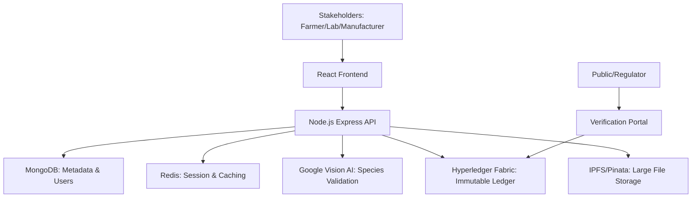

# 🏛️ BotaniLedger Architecture

Detailed technical overview of the BotaniLedger ecosystem, its data flows, and security protocols.

---

## 🏗️ System Overview

BotaniLedger is designed as a multi-tier distributed application ensuring the integrity of botanical supply chains.

---

## 📊 Data Flow & Lifecycle

### 1. Stewardship & Onboarding
- **Identity**: Handled via JWT and role-based access control (RBAC).
- **Approval**: New stakeholders enter a `pending` state. The AYUSH Admin must verify physical credentials before activating the account.

### 2. The Provenance Event (Collection)
- **Input**: Farmer scans a botanical sample.
- **Verification**: The image is sent to an AI service (CNN/Vision API) to ensure the species matches the claim.
- **Anchoring**: If confidence > 85%, a `ProvenanceRecord` is created. 
- **Ledger**: The record hash, timestamp, and farmer ID are committed to the Hyperledger Fabric channel.

### 3. Quality Assurance (testing)
- **Sample Linkage**: Labs receive samples with a Batch ID.
- **Digital Twins**: Lab results (purity, moisture, chemical profile) are uploaded as encrypted PDFs to IPFS.
- **Blockchain Hash**: The IPFS CID (Content Identifier) is linked to the Batch ID on the ledger.

### 4. Manufacturing & QR Bridge
- **Verification**: Manufacturers scan batch IDs to verify the entire history.
- **Aggregration**: Multiple botanical batches can be combined into a single finished product.
- **Consumer Trust**: A final Product ID is generated with a public-facing QR code.

---

## 🔒 Security Measures

- **Immutable Ledger**: Fabric ensures that once a batch is verified, its history cannot be modified by any single party.
- **Rate Limiting**: Express middleware prevents brute-force attacks on the API.
- **Encryption**: Sensitive certificates are stored with hash-verification on decentralized storage.
- **Audit Trails**: Every administrative action is logged and visible to regulators.

---

## 📈 Monitoring & Scalability

- **Monitoring**: Prometheus and Winston logs track system health.
- **Caching**: Redis optimized heavy ledger queries to provide low-latency reads.
- **Offline Reliability**: Farmers use a Zustand-based sync engine to record data without active internet; syncing occurs once a stable connection is found.
